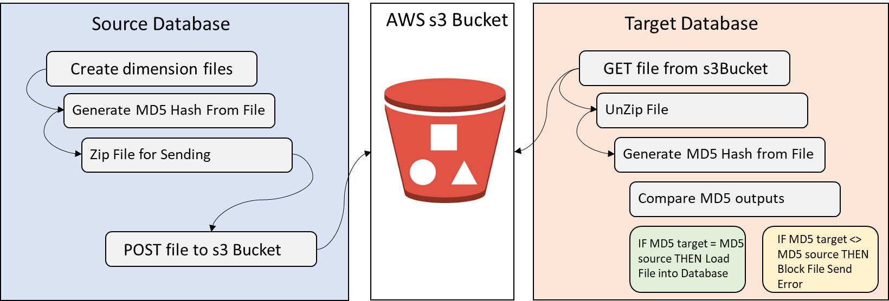

# M10 Exercise: Create a flat file exchange with a checksum 

In this exercise, you will follow the steps to create a flat file exchange from your MySQL database and load it into an s3 bucket. The following are the steps that we will take: 

<ul>
<li>Step 1. Generate Dimension Files. Steps below. In this example, we will generate just one file. </li>
<li>Step 2. Move Files to folder 'checksum'</li>
<li>Step 3. Create check sum procedure</li>
<li>Step 4: Zip files with checksum in directory called checksum. </li>
<li>Step 5: Load zipped package into AWS S3 with checksum. </li> 
</ul>

## What is the benefit of this exercise?
Fundamentally, it is to learn about file verification processes. With this exercise you will get an opportunity to use the dimension files that we have created in previous labs. Moreover, this lab contains a <a href ="https://en.wikipedia.org/wiki/MD5"  target=”_blank”>MD5 hash procedure</a>, which will be generated from the dimension flat file that you have created. The MD5 hash algorithm will provide an output based on the data in the file. When the file is sent to the target database, the same check procedure. This same MD5 hash should produce the same output if the file has not been corrupted (data in the file has changed). If the file is corrupted (i.e., the data in the file has been altered), a different hashed output will occur and the file should be blocked. Hence, this procedure is used for data integrity and file verification processes. 



See <a href ="https://www.securityfocus.com/bid/11849/discuss" target=”_blank”>MD5 Message Digest Algorithm Hash Collision Weakness </a> and take note of the vulnerabilities of the MD5 hash algorithm in particular. Other <a href = "https://en.wikipedia.org/wiki/Secure_Hash_Algorithms"  target=”_blank”>hash alogorithms</a> are more secure and used for different security purposes. This exercise is meant to be a worked example. 


## What you need to complete this exercise?
You will need to have the following installed in order to complete the exercise: 
<ul>
<li>Python 3.0+</li>
<li>Jupyter</li>
<li>MySQL v8.0+</li>
</ul>

The following Python Libraries are used:  email, smtplib, ssl, xlrd, xlwt, s3fs, hashlib, shutil, time, boto3, os, re, mysql.connector.

You also should have installed the DAV6100 database we have used in this class. 

For the s3fs and boto3 libraries it is important that you followed the exercises in M9 in order to complete assigning your AWS credentials and connect to AWs, create and upload a file to that location. 

The exercise has scripts loaded into this GitHub in the following location: flat_file_exchange/scripts. You will need to downlaod these scripts in order to run them to complete the exercise. 

You will be graded on your output. 

## Step 1. Generate Dimension Files. Steps below. In this example, we will generate just one file. 
After you have successfully downloaded the scripts and imported the requisite libraries you'll want to follow the first step to generate the dimensions. 

When running the script you will have to make sure you specify your MYSQL output location. This is in your options>security file location. It is the location where the OUTFILE function where place the file you have generated from the dimension. It might look something like this: 'C:/ProgramData/MySQL/MySQL Server 8.0/Uploads'

```
output_file_location = '**MYSQL_OUTPUT_FILE_LOCATION**'
```

Next you will have to enter your credentials for the local instance of your MySQL server. Note: we are using your local instance of MySQL to replicate the Source Database Server experience. This assumes that you are using local host and port 3306. 

```
connection = mysql.connector.connect(user='**MYSQL_USERNAME**', password='**MYSQL_PASSWORD**',host='localhost', port ='3306')
print('Connected to database.')
cursor = connection.cursor()
```

Once you have connected to the server, you will run dimension output example provided. This will only out put the date dimension for the dav6100 database you have installed. 
You will need to make sure that the location is appropriately assigned:

```
sql_file = "**./dimension_output_example.sql**"
```
## Step 2. Move Files to folder 'checksum'
This step is pretty straight forward. We strip the latest file name and use it to create a folder where the CSV will be placed. You will need to identify the directory for the location of this file.  This also takes the execution time of the file and uses it in the folder name. This will be helpful later to ensure we pull the latest set of files from the server. 
```
directory_name = '**DIRECTORY_FOR_YOUR_FILE**'+'DAILY_DIMENSIONS_%s'%(executiontime)
```
## Step 3. Create check sum procedure
This procedure uses the hashlib to read the CSV file, then generate the Hash output. Inspect the script and run it. 

## Step 4: Zip files with checksum in directory called checksum.
This step in the exercise will generate a zipped file, then save it to your specified location. You will have to be sure to specify where to save the zipped file. You can, of course, save it to the same directory as the folder that you created in Step 2. The output will provide the latest zipped file name. This will be important in providing the location of the zipped package for the s3 POST action. The zipped folder should contain both the MD5 hashed text file and the data dimension CSV file. 
```
file_regex_zip = re.compile(r'DAILY_DIMENSIONS_\d{14}.zip$')
files_in_directory_zip = os.listdir('**DIRECTORY_WHERE_YOU_SAVED_YOUR_ZIP_FILE**')
filtered_files_zip = [ x for x in files_in_directory_zip if file_regex_zip.match(x)]
sorted_files_zip = sorted(filtered_files_zip,reverse=True)
zipFileName = sorted_files_zip[0]
```

## Step 5: Load zipped package into AWS S3 with checksum.
The final step is to load the zipped package containing the MD5 hash file and CSV file to S3. You will have to create an S3 bucket in your account and put that name below. Remember that AWS s3 Buckets must be unique. 
```
s3pathName = '**S3_BUCKET_NAME**'  #specify name of your s3 bucket
```

## Completing the Exercise
This concludes the exercise. Once you have completed the exercises, take a screenshot of the bucket and the zipped file loaded into your S3 bucket. It should look something like below, and be sure to provide that screenshot and the zipped package itself as an indication that you have completed the execise. Congratulations!


